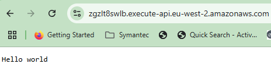

# UC04-Lamda-deployment
This repo is used to create Lambda Function with API Gateway and VPC - Terraform Deployment

**ARCHITECTURE**

TECH STACKS

**AWS**

**DOCKER**

**TERRAFORM**

**GITHUB ACTIONS**

**DIRECTORY TREE**

The app directory contains a sample python code with a lamda handler function

It has a docker file for the application in the same app directory.

we have created terraform module for VPC and other resources. The **TERRAFORM** directory includes :

********************************************************************
1. main.tf : It includes the vpc modules for creation of vpc and a public and private subnet which will be within the api gateway. It also creates an Amazon Elastic Container Registry (ECR) repository with the name hello-world-lambda. ECR is used to store Docker images, which can be used by AWS Lambda.It creates a Lambda function named hello-world.IAM role and permissions is used for the lamda function.The role allows the Lambda service (lambda.amazonaws.com) to assume it.The function uses a Docker image specified by var.image_uri.The function is associated with the IAM role created earlier.
we also create a security group named lambda_sg for the Lambda function.
We then create an HTTP API Gateway named hello-world-api.
HTTP APIs is used for the lamda function
We use API INTEGRATION with LAMDA to integrate the Lambda function with the API Gateway.
The integration_type is set to AWS_PROXY, which means the API Gateway will forward requests to the Lambda function.
The integration_method is set to POST, and the payload_format_version is set to 2.0.
The $default method is used and we set autodeploy to true.

2. providers.tf : This is where we define our provder and remote backend which is S3

3. variables.tf : input variables for the terraform resource

***********************************************************
**GITHUB ACTION**

we have created a workflow for the deployment of this resources. 

This workflow runs whenever a commit is pushed to the main branch. We have set different variables in GITHUB secrets.

First it Pulls the repository's code so it can be accessed in the workflow.
configures aws using variables stored and also logs into ecr
It then builds and pushes the docker image to ecr.

once the image is availabvle in ecr, it starts running terraform apply which creates all the necessary resources including lamda, api gateway.

once the infra gets provisioned you can select the $default for the api gateway and get the invoke url with which you can access the web.

*************************************************************

**OUTPUT**

            

